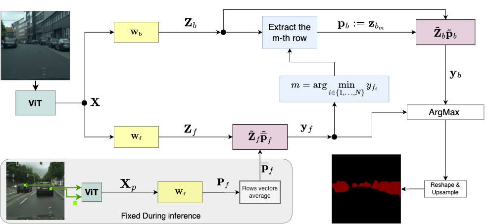

# Implementation of EWS: Extremely Weakly Supervised Binary Semantic Segmentation via Pixel-Point Guided Supervision

Matthaios Tzimas, Christos Papaioanidis, Vasileios Mygdalis, Ioannis Pitas

Under submission to Elsevier’s Pattern Recognition journal.
<div align="left">
  
</div><br/>

## Environment Setup

To set up the environment, run the following commands:

```bash
conda env create -f environment_EWS.yml
conda activate EWS_env
pip install torch==1.7.1+cu110 -f https://download.pytorch.org/whl/torch_stable.html
cd code/src
```

# Running on Cityscapes Dataset

## Dataset Preparation

First, you need to transform the Cityscapes dataset into a binary format for a specific **category**. Update the following parameters inside `code/src/train_config.yaml` (it is recommended to use absolute paths):

- **raw_dataset_path**: Path to the original Cityscapes dataset.
- **pytorch_data_dir**: Path to store the transformed Cityscapes dataset (a folder named `CityscapesOne` will be created).
- **city_category**: The category you wish to segment.

Then, run the following command:

```bash
python citytoclass.py
```

## Configuration File

To generate the initial annotated points randomly, set the following in `train_config.yaml`:

```yaml
generate_points: True
random_imgs: 4  # Number of images from which annotations will be extracted.
random_points: 4  # Number of pixel-point annotations per image.
```

If `generate_points` is set to `False`, you can manually select pixel points for training by modifying the `annotations` field:

```yaml
annotations: {
  "class": [
    ["./dataset/<image_to_annotate>.png", 669, 452],
    ["./dataset/<image_to_annotate>.png", 123, 354]
  ]
}
```

You can add as many images and points per image as needed. There is no restriction on the number of annotated points per image.

## Training

To generate prototypes based on `random_imgs` and `random_points` or the manual annotations, run:

```bash
python generate_prototypes.py
```

Then, to train the model, execute:

```bash
python train_segmentation.py
```

## Training on a Custom Dataset

Ensure your dataset follows this structure:

```
dir_dataset_name/
  imgs/
    train/
      train_1.png
      train_2.png
      ...
    val/
      val_1.png
      val_2.png
      ...
  labels/
    train/
      train_1.png
      train_2.png
      ...
    val/
      val_1.png
      val_2.png
      ...
```

If the filenames in `imgs/train` and `labels/train` do not match, modify the `src/data.py` file accordingly.

Next, precompute the shifts required for the contrastive loss. Although these shifts could be computed dynamically during training, precomputing them speeds up debugging and training. For a given dataset, these shifts remain consistent.

Run the following command:

```bash
python precompute_shifts_gmm.py
```

Then, repeat the training steps described above.

## Results

You can visualize the training results using TensorBoard:

```bash
tensorboard --logdir logs
```

## Citation
Details will be provided once the paper is published.


## Acknowledgement

This repository is built upon the [STEGO](https://github.com/mhamilton723/STEGO) repository.
